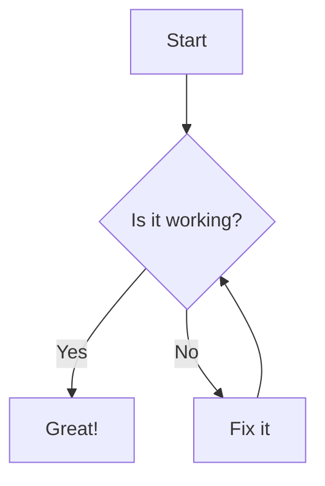
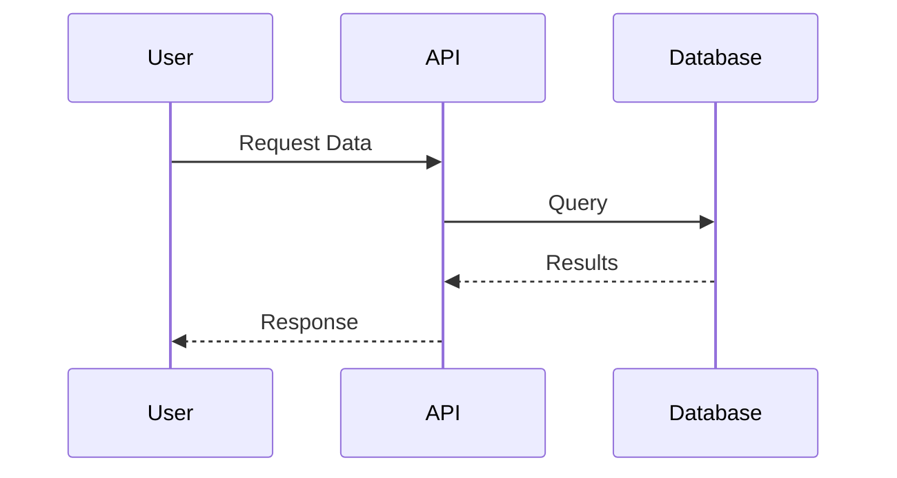
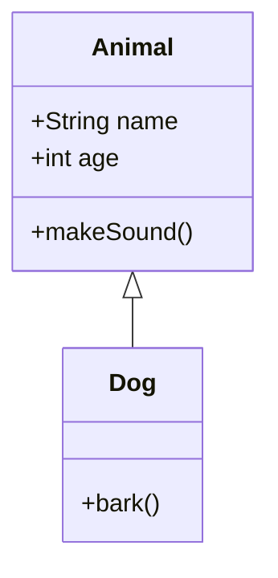
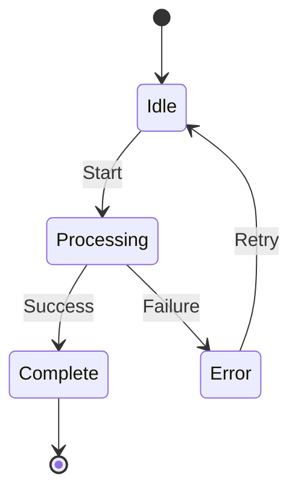
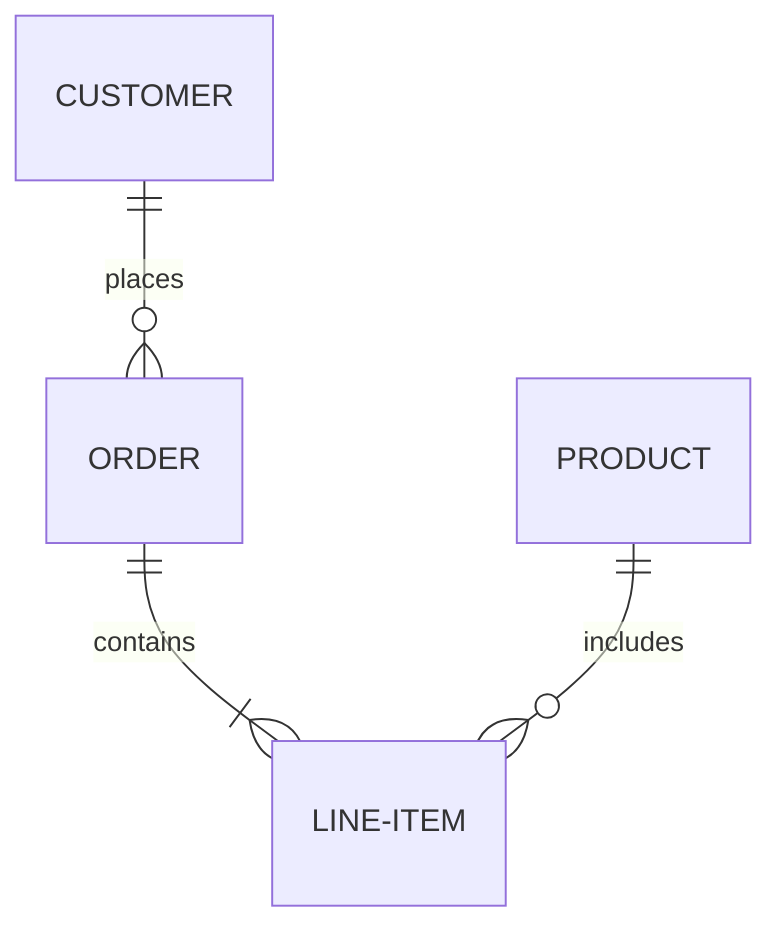

# Mermaid Diagram Rendering in CodeSensei

## What is Mermaid?

Mermaid is a JavaScript-based diagramming and charting tool that uses text-based definitions to create diagrams dynamically. It's perfect for documentation because diagrams are defined in simple, readable text format.

## Automatic Rendering

CodeSensei automatically detects and renders all Mermaid diagrams in the generated tutorial markdown files. No manual intervention needed!

### Where It Works

Mermaid diagrams are rendered in:
- ✅ **Real-time file previews** during generation
- ✅ **Results page** - Index and all chapter files
- ✅ **Downloaded tutorials** (when viewed in compatible markdown viewers)

## Supported Diagram Types

### 1. Flowchart


### 2. Sequence Diagram


### 3. Class Diagram


### 4. State Diagram


### 5. Entity Relationship Diagram


## How LLM Generates Diagrams

The tutorial generator prompts the LLM to create Mermaid diagrams for:
- **Architecture overviews** - System components and relationships
- **Process flows** - How data moves through the system
- **Sequence diagrams** - Component interactions
- **Concept relationships** - How abstractions connect

Example from generated tutorial:
```markdown
## How Request Processing Works

Here's how a request flows through the system:

\```mermaid
sequenceDiagram
    participant Client
    participant Router
    participant Handler
    participant Database
    
    Client->>Router: HTTP Request
    Router->>Handler: Route to handler
    Handler->>Database: Query data
    Database-->>Handler: Return results
    Handler-->>Client: JSON Response
\```

Let's break this down step by step...
```

## Rendering Quality

The app renders diagrams with:
- **High resolution** - Crisp, clear graphics
- **Interactive** - Hover effects and tooltips
- **Responsive** - Adapts to container size
- **Professional styling** - Clean, modern appearance
- **Scrollable** - Large diagrams don't break layout

## Browser Compatibility

Mermaid diagrams work in all modern browsers:
- ✅ Chrome/Edge (Chromium-based)
- ✅ Firefox
- ✅ Safari
- ✅ Opera

## Tips for Best Results

1. **Keep diagrams focused** - Don't try to show everything in one diagram
2. **Use clear labels** - Short, descriptive names work best
3. **Limit complexity** - 5-10 nodes is ideal for readability
4. **Add context** - Explain the diagram in surrounding text
5. **Test locally** - The LLM generates Mermaid syntax, so valid syntax is key

## Troubleshooting

### Diagram Not Rendering?

1. **Check syntax** - Mermaid is picky about syntax
2. **Look for errors** - Browser console shows Mermaid errors
3. **Refresh page** - Sometimes a reload helps
4. **Check markdown** - Ensure code block uses ` ```mermaid ` (not ```diagram)

### Common Issues

**Issue**: Diagram too small
- **Solution**: Use the scroll functionality or adjust diagram complexity

**Issue**: Text overlapping
- **Solution**: Reduce label length or simplify diagram

**Issue**: Diagram not loading
- **Solution**: Check internet connection (uses CDN for Mermaid.js)

## Learn More About Mermaid

- Official Docs: https://mermaid.js.org/
- Live Editor: https://mermaid.live/
- Syntax Reference: https://mermaid.js.org/intro/syntax-reference.html

## Why Mermaid?

✅ **Text-based** - Easy to version control and edit
✅ **No images** - Generated dynamically from code
✅ **Maintainable** - Update diagram by editing text
✅ **Portable** - Works across platforms
✅ **Professional** - Production-quality output
✅ **Fast** - No need for external diagram tools

Mermaid makes technical documentation more visual, engaging, and easier to understand!

